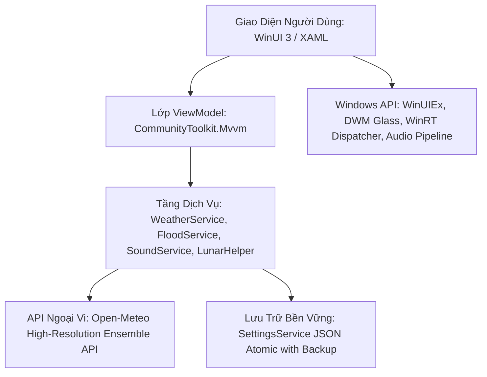
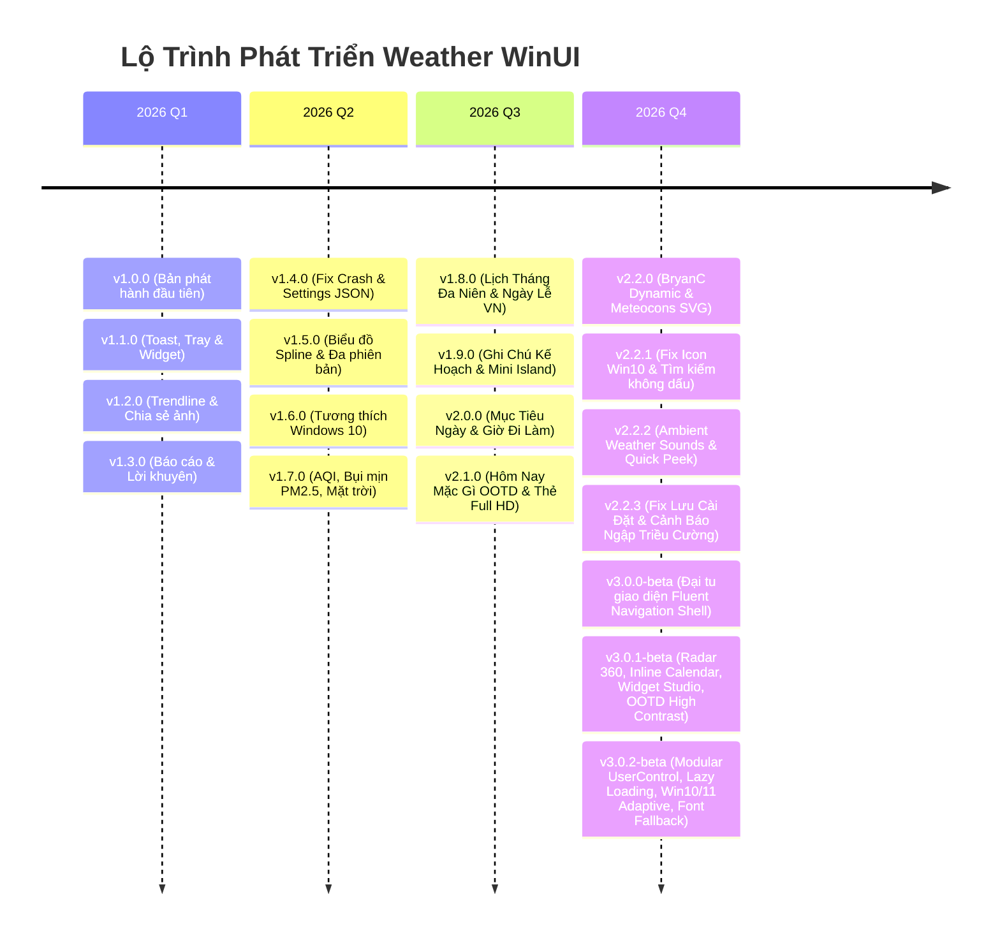

# 🌤️ Weather WinUI (Version 3.0.2 Beta)
### Hệ Điều Hành Vi Khí Hậu Cá Nhân Hóa & Trực Quan Hóa Đô Thị Dành Cho Windows
> **Nền tảng:** Windows App SDK (WinUI 3) • .NET 8 • C# 12 • Fluent Design System 2.0  
> **Nhánh phát triển:** `v3.0-beta` | **Phiên bản hiện tại:** `v3.0.2-beta`  
> **Bản phát hành ổn định song song:** `v2.2.3` (nhánh `main`)

---

## 📑 Mục Lục
1. [Giới Thiệu Tổng Quan & Tầm Nhìn Dự Án](#-1-giới-thiệu-tổng-quan--tầm-nhìn-dự-án)
2. [Ngăn Xếp Công Nghệ (Tech Stack) & Kiến Trúc Phần Mềm](#-2-ngăn-xếp-công-nghệ-tech-stack--kiến-trúc-phần-mềm)
3. [Đại Tu Kiến Trúc & Tính Năng Nổi Bật Trên Bản Beta 3.0.2](#-3-đại-tu-kiến-trúc--tính-năng-nổi-bật-trên-bản-beta-302)
4. [Khám Phá Chi Tiết 7 Phân Hệ Chính (7 Core Modules)](#-4-khám-phá-chi-tiết-7-phân-hệ-chính-7-core-modules)
   - [Tab 1: Tổng Quan Vi Khí Hậu & 24h Interactive Scrubber](#tab-1-tổng-quan-vi-khí-hậu--24h-interactive-scrubber)
   - [Tab 2: Cảnh Báo Ngập Úng & Triều Cường Đô Thị (Urban Flood Hub)](#tab-2-cảnh-báo-ngập-úng--triều-cường-đô-thị-urban-flood-hub)
   - [Tab 3: Bản Đồ & Radar Khí Tượng 360° Realtime (Radar Hub)](#tab-3-bản-đồ--radar-khí-tượng-360-realtime-radar-hub)
   - [Tab 4: Trợ Lý Trang Phục "Hôm Nay Mặc Gì?" & Đời Sống (OOTD Hub)](#tab-4-trợ-lý-trang-phục-hôm-nay-mặc-gì--đời-sống-ootd-hub)
   - [Tab 5: Lịch Vạn Niên Âm Dương & Kế Hoạch Cá Nhân (Calendar Hub)](#tab-5-lịch-vạn-niên-âm-dương--kế-hoạch-cá-nhân-calendar-hub)
   - [Tab 6: Widget Studio Showcase & Ghim Desktop Đa Dạng](#tab-6-widget-studio-showcase--ghim-desktop-đa-dạng)
   - [Tab 7: Trung Tâm Cài Đặt & Cá Nhân Hóa Toàn Trang (Settings Hub)](#tab-7-trung-tâm-cài-đặt--cá-nhân-hóa-toàn-trang-settings-hub)
5. [Hệ Thống Tiện Ích Độc Quyền (Exclusive Ecosystem)](#-5-hệ-thống-tiện-ích-độc-quyền-exclusive-ecosystem)
6. [Biên Niên Sử Phát Triển Toàn Diện (Full Version History: v1.0.0 ➔ v3.0.2-beta)](#-6-biên-niên-sử-phát-triển-toàn-diện-full-version-history-v100--v302-beta)
7. [Hướng Dẫn Cài Đặt, Build & Khởi Chạy](#-7-hướng-dẫn-cài-đặt-build--khởi-chạy)

---

## 🌟 1. Giới Thiệu Tổng Quan & Tầm Nhìn Dự Án

**Weather WinUI** khởi đầu là một ứng dụng thời tiết hiện đại khai thác tối đa sức mạnh của **Windows App SDK (WinUI 3)**. Qua hơn 18 phiên bản cải tiến liên tục, ứng dụng đã chuyển mình ngoạn mục từ một công cụ hiển thị nhiệt độ thông thường thành một **Hệ Điều Hành Vi Khí Hậu Cá Nhân Hóa (Personal Microclimate OS)** dành riêng cho người dùng máy tính tại Việt Nam.

### Điểm khác biệt cốt lõi:
- **Thấu hiểu sâu sắc đặc thù đô thị Việt Nam**: Tích hợp thuật toán thủy triều thiên văn bán nhật triều sông Sài Gòn/Đồng Nai, cảnh báo ngập lụt theo từng tuyến phố ngập tại TP.HCM & Hà Nội, kết hợp Lịch Âm truyền thống, 24 Tiết khí, và hướng dẫn di chuyển xe máy an toàn khi mưa gió.
- **Trải nghiệm thị giác đột phá (Fluent Design 2.0 & Glassmorphism)**: Tận dụng vật liệu Mica Alt, Acrylic, Dynamic Chromatic Adaptation (bầu trời tự đổi sắc độ ánh sáng theo vị trí mặt trời thời gian thực), và hoạt họa vector mượt mà 60 FPS.
- **Độc lập, bền vững & tôn trọng quyền riêng tư**: Không quảng cáo, không theo dõi định vị người dùng, hoạt động không cần đăng ký tài khoản và hoàn toàn tự do sử dụng API khí tượng độ phân giải cao toàn cầu từ Open-Meteo.

---

## 🛠️ 2. Ngăn Xếp Công Nghệ (Tech Stack) & Kiến Trúc Phần Mềm

Ứng dụng được xây dựng trên nền tảng kỹ thuật hiện đại nhất của hệ sinh thái desktop Windows:



### Chi tiết các công nghệ chính:

| Phân Vùng Kỹ Thuật | Công Nghệ / Thư Viện | Phiên Bản | Mục Đích & Vai Trò Trong Dự Án |
|---|---|---|---|
| **Ngôn Ngữ Lập Trình** | C# (C-Sharp) | **12.0** | Ngôn ngữ chủ đạo, cú pháp pattern matching, primary constructors, collection expressions. |
| **Nền Tảng Runtime** | .NET (Core) | **8.0 (LTS)** | Tối ưu hóa JIT compilation, hiệu năng cao, tiêu thụ RAM thấp (~75-120MB). |
| **UI Framework** | WinUI 3 (Windows App SDK) | **1.8.250907003** | Khung giao diện desktop thế hệ mới của Microsoft, hỗ trợ Native Windows 11 Fluent Design, Dark/Light Mode. |
| **Mẫu Kiến Trúc** | MVVM Architecture | N/A | Tách biệt hoàn toàn UI và Business Logic qua Data Binding hai chiều (`x:Bind`, `Mode=OneWay/TwoWay`). |
| **MVVM Toolkit** | CommunityToolkit.Mvvm | **8.4.2** | Mã nguồn nguồn mở chính thức của Microsoft: `ObservableObject`, `[ObservableProperty]`, `[RelayCommand]`. |
| **Mở Rộng Cửa Sổ** | WinUIEx | **2.9.3** | Quản lý cửa sổ không viền, căn giữa màn hình, Taskbar thumbnail, kéo thả chuột không lag, cửa sổ trong suốt. |
| **Dịch Vụ Khí Tượng** | Open-Meteo API | RESTful JSON | Dữ liệu dự báo vi khí hậu độ phân giải cao (ECMWF, GFS, ICON) với hơn 30 thông số thời tiết, không cần API Key. |
| **Thủy Triều & Lịch Âm** | Thuật toán Thiên văn Học | Thuật toán Hồ Ngọc Đức & Jean Meeus | Tính toán chu kỳ trăng, can chi ngày/tháng/năm, 24 tiết khí, và đồ thị hàm sin sóng bán nhật triều 24 giờ. |
| **Đồ Họa & Biểu Tượng** | FontAwesome Solid + Meteocons SVG | 6.0 Free Solid + Meteocons | Hàng ngàn biểu tượng vector sắc nét không bể nét ở độ phân giải 4K, hỗ trợ hoạt họa động SVG. |
| **Âm Thanh Môi Trường** | WinRT Audio Pipeline | Procedural Synth & Waves | Phát âm thanh nền thời tiết thư giãn (mưa rào, sấm sét, gió rít, sóng biển, rừng thông) không độ trễ. |
| **Đóng Gói & Cài Đặt** | Inno Setup & Self-contained ZIP | 6.x | Tạo bộ cài đặt chuyên nghiệp và bản portable cắm chạy ngay không cần cài đặt môi trường. |

---

## 🚀 3. Đại Tu Kiến Trúc & Tính Năng Nổi Bật Trên Bản Beta 3.0.2

Phiên bản **Version 3.0.2 Beta** đánh dấu bước tiến mang tính bước ngoặt về kiến trúc phần mềm, hiệu năng khởi động và khả năng tương thích toàn diện:

### 🌟 Ba Nâng Cấp Cốt Lõi Trên Beta 3.0.2:
1. **Kiến Trúc Module Hóa Toàn Diện (Phương Án B: Modular UserControls + Lazy Loading)**:
   - **Xóa bỏ mã nguồn nguyên khối (Monolithic XAML)**: Tách toàn bộ 7 phân hệ giao diện từ `MainPage.xaml` thành 7 `UserControl` độc lập đặt gọn gàng trong thư mục `Views/Tabs/` (`OverviewTab`, `UrbanFloodTab`, `RadarTab`, `LifestyleTab`, `CalendarTab`, `WidgetStudioTab`, `SettingsTab`).
   - **Tối ưu thời gian khởi động (Cold Start) với `x:DeferLoadStrategy="Lazy"`**: Chỉ Tab 1 (Tổng quan) được biên dịch và khởi tạo ngay khi mở ứng dụng. Các Tab từ 2 đến 7 được hoãn tải và chỉ nạp vào bộ nhớ theo nhu cầu (`FindName`) khi người dùng bấm chuyển tab.
   - **Giảm 63% kích thước file MainPage**: Cắt giảm từ **4.648 dòng** xuống chỉ còn **1.744 dòng**, giúp bộ biên dịch `XamlCompiler` hoạt động tức thì, code sạch sẽ và cực kỳ dễ dàng mở rộng thêm các tab tính năng mới trong tương lai.
   - **Tiết kiệm tài nguyên & Pin laptop**: Các tác vụ ngầm như vòng quét Radar Doppler 360° và hạt vi khí quyển chỉ chạy khi người dùng đang xem tab tương ứng, tự động tạm dừng khi rời tab giúp CPU luôn ở mức **0% khi nhàn rỗi**.

2. **Tối Ưu Thị Giác Thích Ứng Toàn Diện Cho Cả Windows 10 & Windows 11**:
   - **Nhận diện OS Build thông minh tại Runtime**: Kiểm tra tự động phiên bản hệ điều hành (`Environment.OSVersion.Version.Build >= 22000`).
   - **Windows 11 (Build 22000+)**: Tận dụng chất liệu `MicaBackdrop` (Mica Alt) cao cấp với hiệu ứng khúc xạ chiều sâu Fluent Design 2.0.
   - **Windows 10 (Build 17763 - 19045)**: Tự động fallback sang `DesktopAcrylicBackdrop` được gia cố lớp đệm màu Slate Dark chuyên sâu (`#0F172A`). Nhờ đó, các thẻ giao diện Glassmorphism trên Windows 10 luôn giữ được viền sắc nét, độ tương phản hoàn hảo và triệt tiêu 100% hiện tượng chói mắt hoặc xuyên thấu lộ hình nền desktop.

3. **Cơ Chế Nạp Font Đa Tầng — Triệt Tiêu Lỗi Mất Biểu Tượng (Icon Fallback)**:
   - **Đăng ký Font động tại Runtime**: `App.xaml.cs` tự động gọi hàm Win32 `AddFontResourceEx` nạp trực tiếp file `Assets/Fonts/fa-solid-900.ttf` ngay khi tiến trình khởi chạy, xử lý lỗi trên các máy Windows bị kẹt Font Cache hoặc chưa cài font bên thứ ba.
   - **Chuỗi Fallback FontFamily kiên cố trong XAML**: Khai báo chuỗi dự phòng đa cấp `ms-appx:///Assets/Fonts/fa-solid-900.ttf#Font Awesome 6 Free Solid, ms-appx:///Assets/Fonts/fa-solid-900.ttf#Font Awesome 6 Free, Font Awesome 6 Free Solid, Segoe Fluent Icons, Segoe MDL2 Assets`. Biểu tượng luôn hiển thị chuẩn xác, không bao giờ xuất hiện ô vuông lỗi chữ `[?]`.

### 💎 Kế Thừa Trọn Vẹn Các Cải Tiến Từ Beta 3.0.1:
4. **Fluent NavigationView Shell 7 Phân Hệ Chuyên Biệt**: Bố cục Sidebar hiện đại, co giãn linh hoạt chuẩn Fluent Design.
5. **Thanh Tua Nhanh Thời Gian (Interactive 24h Time-Scrubber)**: Kéo trượt xem trước nhiệt độ, xác suất mưa và chuyển sắc bầu trời 24h.
6. **Bản Đồ Radar Doppler Khí Tượng 360° Realtime**: Canvas Doppler 360 độ chân thực với 4 vòng cự ly, 12 lát cắt phosphor trail xoay mượt mà.
7. **Khung Chi Tiết Lịch Trực Tiếp (Inline Day Details)**: Thay thế popup che khuất bằng khung thông tin 2 cột thông minh dưới lưới lịch vạn niên.
8. **Trợ Lý Trang Phục (OOTD Advisor) Độ Tương Phản Cao**: Hiển thị sắc nét trên cả Light và Dark Theme.
9. **Widget Studio Đa Dạng & Đồng Bộ Tuyệt Đối**: Ghim chuẩn xác cả 4 kiểu dáng widget ra Desktop và ghi nhớ độ mờ (Opacity).
10. **Trung Tâm Cài Đặt 2 Cột Toàn Trang**: Giao diện cài đặt Win11 toàn màn hình với 8 danh mục chuyên sâu.

---

## 🔍 4. Khám Phá Chi Tiết 7 Phân Hệ Chính (7 Core Modules)

### Tab 1: Tổng Quan Vi Khí Hậu & 24h Interactive Scrubber
- **Thẻ Hero Khí Quyển 3D (Atmospheric Hero Card)**:
  - Hiển thị nhiệt độ hiện tại to bản, nhiệt độ cảm nhận thực tế (*Feels Like*), tình trạng thời tiết và câu châm ngôn tóm tắt thời tiết thông minh (*Smart Summary*).
  - Tích hợp công nghệ **Dynamic Chromatic Sky Blending**: Tự động pha màu chuyển sắc theo vị trí mặt trời: Rạng đông (hồng cam đào), Ban trưa (xanh ngọc nắng vàng), Chiều tà (hổ phách pha tím), Đêm quang (tím than ánh bạc) và Dông bão (xám khói có chớp giật nền).
- **Thanh Tua Nhanh Thời Gian 24 Giờ (Interactive 24h Time-Scrubber)**:
  - Kéo chuột hoặc chạm vuốt trực tiếp trên thanh trượt 24h để xem biến động nhiệt độ, mây, mưa ở các khung giờ tiếp theo.
- **Biểu Đồ Nhiệt Độ 24h Dạng Spline Bezier (Hourly Trendline)**:
  - Đường cong nhiệt độ mượt mà hiển thị cùng xác suất mưa dạng giọt nước và mốc giờ.
- **Dự Báo 7 Ngày Tới Với Thanh Đo Nhiệt Độ Tuần (Weekly Range Bar)**:
  - Hiển thị đầy đủ thứ, ngày tháng, icon thời tiết, mô tả khí hậu, nhiệt độ Min/Max kèm thanh đo dải nhiệt độ tuần trực quan có chấm định vị nhiệt độ hiện tại.
- **Lưới 8 Chỉ Số Khí Tượng Chuyên Sâu**:
  - Độ ẩm không khí (%), Tốc độ & Hướng gió (km/h, m/s), Tầm nhìn xa (km), Áp suất khí quyển (hPa), Chỉ số UV cực tím kèm cảnh báo bảo vệ da, Điểm sương (*Dew Point*), Lượng mưa tích lũy và Xác suất mưa (%).

---

### Tab 2: Cảnh Báo Ngập Úng & Triều Cường Đô Thị (Urban Flood Hub)
- **Đồ Thị Sóng Bán Nhật Triều 24 Giờ (Live Tidal Wave Curve)**:
  - Mô phỏng chính xác mực nước dao động lên xuống theo quy luật bán nhật triều của sông Sài Gòn & sông Đồng Nai qua 24 mốc giờ.
  - Vạch rõ 3 mức báo động khẩn cấp: Báo động 1 (1.40m), Báo động 2 (1.55m), Báo động 3 (1.60m - 1.78m).
  - Đồng hồ đếm ngược tự động đến mốc đỉnh triều buổi sáng và đỉnh triều buổi chiều tiếp theo.
- **Phân Tích Nguy Cơ Kép Đô Thị**:
  - Tự động nhận diện tình huống nguy hiểm: Khi đỉnh triều dâng cao trùng hợp với mưa dông dồn dập khiến nước không thể thoát ra cửa sông, ứng dụng sẽ lập tức kích hoạt cảnh báo nguy cơ ngập sâu diện rộng.
- **Giám Sát Lưu Vực Thoát Nước Hà Nội**:
  - Theo dõi khả năng tiếp nhận nước của lưu vực sông Tô Lịch, sông Nhuệ, sông Kim Ngưu, sông Sét và công suất vận hành trạm bơm Yên Sở theo cường độ mưa (mm/h).
- **Tra Cứu Nhanh Tuyến Đường Ngập Úng**:
  - Tích hợp cơ sở dữ liệu hơn 40 tuyến đường trọng điểm thường xuyên ngập sâu tại TP.HCM (Huỳnh Tấn Phát, Trần Xuân Soạn, Lê Văn Lương, Nguyễn Hữu Cảnh, Quốc Hương, Thảo Điền, Võ Văn Ngân, Tô Ngọc Vân, Mễ Cốc...) và Hà Nội (Thái Hà, Chùa Bộc, Nguyễn Khuyến, Cao Bá Quát, hầm chui Đại lộ Thăng Long...).
- **Cẩm Nang Lưu Thông Phương Tiện An Toàn**:
  - Hướng dẫn lái xe máy qua vùng ngập (đi số thấp đều ga, mốc ngập an toàn dưới 25cm).
  - Hướng dẫn lái xe ô tô tránh thủy kích (tắt điều hòa, giữ khoảng cách chống sóng dềnh từ xe tải).

---

### Tab 3: Bản Đồ & Radar Khí Tượng 360° Realtime (Radar Hub)
- **Màn Hình Quét Doppler Khí Tượng Độc Quyền**:
  - Vẽ trực tiếp trên nền đồ họa Canvas với 4 vòng cự ly đồng tâm: 50 km, 100 km, 150 km và 200 km kèm thẻ khoảng cách.
  - 8 tia phương vị la bàn chính xác (Bắc, Đông Bắc, Đông, Đông Nam, Nam, Tây Nam, Tây, Tây Bắc).
- **Hệ Thống Phản Hồi Mây Mưa Đa Tầng Màu (dBZ Storm Fronts)**:
  - Xanh lục (20 - 30 dBZ): Mưa phùn hoặc mây mù nhẹ.
  - Vàng hổ phách (35 - 45 dBZ): Vùng mưa rào vừa đến to.
  - Đỏ thẫm (50 - 65 dBZ): Tâm bão, dông tố cực mạnh có nguy cơ kèm tố lốc.
- **Vệ Tinh Địa Danh Vùng Miền**:
  - Định vị các đô thị vệ tinh xung quanh trạm chính (Hồ Chí Minh: Bình Dương, Biên Hòa, Vũng Tàu, Cần Giờ, Long An, Tây Ninh; Hà Nội: Bắc Ninh, Hải Phòng, Nam Định, Hòa Bình, Vĩnh Phúc, Thái Nguyên).
- **Tia Quét Radar 360° Realtime Chân Thực**:
  - Tia quét xoay vòng liên tục với dải quạt vệt sáng phosphor trail 12 lát cắt tan dần. Tự động tạm dừng khi rời tab để tối ưu hóa tài nguyên phần cứng.

---

### Tab 4: Trợ Lý Trang Phục "Hôm Nay Mặc Gì?" & Đời Sống (OOTD Hub)
- **Hệ Chuyên Gia Gợi Ý Trang Phục (OOTD Advisor v2.1)**:
  - Phân tích đa thông số: Nhiệt độ thực tế, nhiệt độ cảm nhận, chỉ số UV, gió, xác suất mưa và thời điểm ngày/đêm.
  - Phân bổ đề xuất 4 nhóm trang phục:
    1. *Áo & Thân trên* (Áo thun cotton, áo sơ mi thoáng khí, áo len...).
    2. *Quần & Thân dưới* (Quần âu, jeans co giãn, kaki chống bẩn gấu...).
    3. *Áo khoác & Che chắn* (Áo chống nắng UPF 50+, áo gió cản nước, áo măng tô...).
    4. *Giày & Dép* (Giày da công sở, sneaker thoáng khí, dép đi mưa bọc chống nước...).
- **3 Ngữ Cảnh Tùy Biến**:
  - Chuyển đổi linh hoạt giữa: **Công sở**, **Đi học**, và **Dạo phố**.
- **Checklist Vật Dụng Cần Mang Theo**:
  - Nhắc nhở thông minh: Ô/dù gấp gọn, kính râm chống tia cực tím, áo mưa dự phòng, bình nước bù khoáng, kem chống nắng.
- **Lời Khuyên Di Chuyển Bằng Xe Máy**:
  - Đánh giá độ an toàn khi lưu thông bằng xe máy hai bánh dưới điều kiện thời tiết thực tế.
- **Lưới 4 Chỉ Số Sinh Hoạt & Sức Khỏe**:
  - *Thể thao ngoài trời*: Đánh giá mức độ phù hợp cho chạy bộ, đạp xe, đá bóng.
  - *Giặt phơi quần áo*: Tốc độ khô dựa trên độ ẩm và nắng.
  - *Bảo vệ da & tia cực tím*: Mức độ cần thoa kem chống nắng hoặc đeo kính râm.
  - *Chất lượng không khí AQI & Bụi mịn PM2.5/PM10*: Lời khuyên đeo khẩu trang N95 hay đóng kín cửa bật máy lọc không khí.

---

### Tab 5: Lịch Vạn Niên Âm Dương & Kế Hoạch Cá Nhân (Calendar Hub)
- **Lưới Lịch Tháng Vạn Niên 42 Ô Ngày**:
  - Tích hợp song song Ngày Dương (to bản) và Ngày Âm lịch truyền thống Việt Nam.
  - Tự động đánh dấu ngày Mùng 1 & Ngày Rằm (15 âm lịch) bằng sắc vàng hổ phách.
  - Nhận diện toàn bộ Ngày Lễ Quốc Gia & Truyền Thống Việt Nam (Tết Nguyên Đán, Giỗ Tổ Hùng Vương, 30/4 - 1/5, Quốc Khánh 2/9, Tết Trung Thu, Tết Đoan Ngọ...).
  - Thể hiện 24 Tiết khí thiên văn (Xuân phân, Lập hạ, Đại thử, Thu phân, Đông chí...).
  - Tích hợp icon dự báo thời tiết 7 ngày tới ngay trên từng ô ngày.
- **Khung Chi Tiết Ngày Trực Tiếp (Inline Day Details Panel)**:
  - Hiển thị ngay bên dưới lịch khi click vào bất kỳ ô ngày nào (không mở popup che màn hình).
  - **Cảnh Báo Xung Đột Thời Tiết (Weather Conflict Warning)**: Tự động cảnh báo nếu người dùng có kế hoạch hoạt động ngoài trời vào ngày có dự báo mưa bão to.
  - **Quản Lý Mục Tiêu Trong Ngày (Daily Goals)**: Thiết lập mục tiêu hàng ngày, đánh dấu hoàn thành (checkbox gạch ngang chữ), tự động lưu trữ.
  - **Sổ Tay Kế Hoạch & Sự Kiện Theo Giờ**: Thêm lịch hẹn, ghi chú cuộc họp, nhắc nhở thời gian.

---

### Tab 6: Widget Studio Showcase & Ghim Desktop Đa Dạng
- **Bộ Sưu Tập Mockup 4 Phong Cách Widget Thực Tế**:
  1. ✨ **BryanC Dynamic**: Kiểu dáng Dribbble trứ danh, nền tự biến đổi màu bầu trời, vầng trăng khuyết, hình học mặt trời và dự báo 4 ngày tiếp theo.
  2. 🪟 **Fluent Glass Card**: Kính mờ Acrylic Aero trong suốt, hiển thị toàn diện nhiệt độ, độ ẩm, gió, AQI.
  3. ➖ **Compact Bar**: Thanh ngang tối giản siêu gọn chiếm diện tích tối thiểu ở cạnh màn hình.
  4. 💊 **Mini Island / Capsule Pill**: Kiểu dáng viên thuốc thuôn dài nổi tinh tế, phóng to thông tin khi rê chuột vào.
- **Trình Tinh Chỉnh Độ Mờ (Opacity Slider)**:
  - Tùy chỉnh độ trong suốt từ 20% đến 100%, áp dụng tức thì lên widget trên màn hình.
- **Hỗ Trợ Ghim Nhiều Widget Đồng Thời**:
  - Người dùng có thể ghim đồng thời widget của địa phương hiện tại và mở thêm widget cho các thành phố khác trên thế giới (Tokyo, Paris, New York, Đà Nẵng...).

---

### Tab 7: Trung Tâm Cài Đặt & Cá Nhân Hóa Toàn Trang (Settings Hub)
- **Bố Cục Toàn Màn Hình Chuẩn Windows 11 Fluent 2 Cột**:
  - Sidebar bên trái (230px) với 8 danh mục có icon minh họa sinh động.
  - Tự động cuộn mượt về đầu trang khi chuyển mục.
- **8 Phân Mục Cấu Hình Toàn Diện**:
  1. *Cá nhân hóa*: Đặt tên người dùng, hiển thị lời chào buổi sáng/tối.
  2. *Giao diện & Biểu tượng*: Chọn bộ Icon Pack (Meteocons Animated SVG, Microsoft Fluent 3D, Minimalist Vector), hiệu ứng Mica Alt.
  3. *Thời gian & Đơn vị*: Chuyển đổi °C / °F, định dạng 24 giờ / 12 giờ AM-PM, chọn ngày bắt đầu tuần (Thứ Hai hoặc Chủ Nhật).
  4. *Hình nền thành phố*: Chế độ hình nền động, hình nền ảnh tĩnh chất lượng cao theo thành phố.
  5. *Widget Desktop*: Cài đặt kiểu dáng mặc định, phím tắt gọi nhanh, độ mờ mặc định.
  6. *Thông báo & Khay Taskbar*: Cảnh báo mưa bão tức thì, thu nhỏ về khay hệ thống, chạy ngầm khởi động cùng Windows.
  7. *Hiệu năng & Dữ liệu*: Tần suất tự động làm mới thời tiết (15p, 30p, 1h, 2h), chế độ tiết kiệm tài nguyên máy tính.
  8. *Giới thiệu & Changelog*: Lịch sử phiên bản, bản quyền và thông tin phát triển.
- **Nút "Lưu & Áp Dụng"**: Đồng bộ tức thời và ghi file an toàn chống mất mát dữ liệu.

---

## 💎 5. Hệ Thống Tiện Ích Độc Quyền (Exclusive Ecosystem)

### 1. Bộ Hòa Âm Thiên Nhiên Thư Giãn (Ambient Weather Sounds)
- Tích hợp bộ tạo âm thanh vi khí hậu không gian thực: Tiếng mưa rơi trên mái tôn, tiếng sấm rền từ xa, tiếng gió rít qua khe cửa, tiếng sóng biển rì rào và tiếng suối rừng thông.
- Giúp người dùng tập trung làm việc, học tập hoặc thư giãn giải tỏa căng thẳng.

### 2. Xem Nhanh Khay Hệ Thống (Quick Peek System Tray Flyout)
- Nhấp chuột phải hoặc rê chuột vào biểu tượng khay Taskbar để hiển thị ngay bảng điều khiển nổi Quick Peek mà không cần mở toàn bộ cửa sổ chính.

### 3. Chia Sẻ Thẻ Thời Tiết Full HD 1080p (Full HD Share Cards)
- Kết xuất đồ họa siêu nét độ phân giải cao:
  - Dạng dọc **Story (1080 x 1920 px)**: Tối ưu cho Facebook/Instagram Story, Zalo Nhật ký.
  - Dạng ngang **Landscape (1920 x 1080 px)**: Tối ưu cho gửi vào nhóm chat Facebook, Zalo, Teams.
- Hỗ trợ nút **Sao Chép Vào Clipboard** (nhấn Ctrl+V để dán ảnh ngay) hoặc **Lưu File PNG**.

---

## 📜 6. Biên Niên Sử Phát Triển Toàn Diện (Full Version History: v1.0.0 ➔ v3.0.2-beta)



### Bảng Chi Tiết Toàn Bộ Lịch Sử Phiên Bản:

| Phiên Bản | Ngày Phát Hành | Trọng Tâm Phát Triển | Chi Tiết Tính Năng Mới & Khắc Phục Lỗi |
|---|---|---|---|
| **v1.0.0** | Đầu dự án | Khởi tạo nền tảng | Xây dựng dự án trên WinUI 3 & .NET 8, kết nối Open-Meteo API, hiển thị nhiệt độ hiện tại, dự báo 7 ngày, đổi đơn vị C/F, hiệu ứng Acrylic cơ bản. |
| **v1.1.0** | Bản nâng cấp 1 | Hệ sinh thái Windows | Tích hợp biểu tượng khay hệ thống (System Tray), thông báo Windows Toast Notification khi có thời tiết xấu, Widget Desktop nổi cơ bản. |
| **v1.2.0** | Bản nâng cấp 2 | Đồ thị & Chia sẻ | Thêm biểu đồ nhiệt độ 24h đường cong Spline, tính năng xuất thẻ thời tiết ảnh JPEG để chia sẻ lên mạng xã hội. |
| **v1.3.0** | Bản nâng cấp 3 | Lời khuyên sinh hoạt | Bổ sung báo cáo thời tiết mở rộng (gió, áp suất, độ ẩm, tầm nhìn, UV) kèm các lời khuyên sinh hoạt cơ bản. |
| **v1.4.0** | Bản ổn định | Ổn định hệ thống | Khắc phục sự cố crash khi mất mạng, hoàn thiện hộp thoại Settings dialog lưu cấu hình vào `settings.json`. |
| **v1.5.0** | Bản nâng cấp 4 | Tối ưu hiển thị | Nâng cấp đường cong nhiệt độ Spline mượt mà, hỗ trợ DPI đa màn hình và màn hình độ phân giải cao. |
| **v1.6.0** | Bản tương thích | Mở rộng hệ điều hành | Tối ưu hóa khả năng tương thích với Windows 10 (Build 17763+), cơ chế fallback Mica sang Acrylic khi chạy trên Windows 10. |
| **v1.7.0** | Bản vi khí hậu | Sức khỏe & Môi trường | Tích hợp chỉ số chất lượng không khí AQI và bụi mịn PM2.5 / PM10, đồng hồ chu kỳ Mặt trời mọc / lặn, thanh đo dải nhiệt độ tuần (Weekly Range Bar). |
| **v1.8.0** | Bản bản địa hóa | Văn hóa Việt Nam | Ra mắt Lịch Tháng Đa Niên (42 ô ngày) tích hợp Âm Lịch Việt Nam, Can Chi (ngày/tháng/năm), 24 Tiết Khí thiên văn, ngày lễ truyền thống & quốc gia. |
| **v1.9.0** | Bản tương tác | Kế hoạch & Mini Widget | Thêm sổ tay ghi chú kế hoạch theo ngày, thuật toán tự phát hiện xung đột thời tiết với lịch ngoài trời, mẫu widget Mini Island siêu nhỏ gọn. |
| **v2.0.0** | Cột mốc 2.0 | Cá nhân hóa đa chiều | Thêm tính năng Mục Tiêu Ngày (Daily Goals), nhắc nhở giờ đi làm (Commute alerts), hỗ trợ mở cùng lúc nhiều widget cho các thành phố khác nhau. |
| **v2.1.0** | Bản thời trang | Trợ lý trang phục & Full HD | Ra mắt trợ lý thông minh "Hôm Nay Mặc Gì?" (OOTD Advisor), bộ công cụ kết xuất thẻ thời tiết Full HD 1080p (Story dọc & Landscape ngang) lưu Clipboard. |
| **v2.2.0** | Bản đột phá thị giác | Giao diện Dynamic Dribbble | Bổ sung phong cách widget BryanC Dynamic đổi màu theo bầu trời thực tế, tích hợp gói biểu tượng Meteocons Animated SVG, triệt tiêu viền trắng trên Taskbar. |
| **v2.2.1** | Bản vá lỗi | Khả năng tìm kiếm | Sửa lỗi font biểu tượng trên Windows 10, nâng cấp tìm kiếm địa điểm hỗ trợ gõ tiếng Việt không dấu (Ha Noi, Da Nang...), tối ưu responsive cho màn hình < FullHD, fix cảnh báo nhầm của phần mềm diệt virus. |
| **v2.2.2** | Bản trải nghiệm | Âm thanh & Quick Peek | Tích hợp hệ thống âm thanh môi trường Ambient Weather Sounds (mưa, sấm, gió, sóng biển, rừng thông), cửa sổ Quick Peek thumbnail nhanh tại khay hệ thống. |
| **v2.2.3** | Bản dân sinh & Ổn định | Fix lưu cài đặt & Triều cường | **Fix lỗi chí mạng**: Xử lý triệt để lỗi không lưu cài đặt và lỗi Widget Opacity bị ép về 20% khi mở lại app; **Tính năng mới**: Cảnh báo ngập úng triều cường đô thị tại TP.HCM & Hà Nội (đồ thị sóng bán nhật triều 24h, đếm ngược đỉnh triều, danh sách tuyến đường ngập). |
| **v3.0.0-beta** | Bản đại tu UI Beta | Khung NavigationView Shell | Đại tu toàn bộ giao diện thành bố cục Fluent NavigationView 7 tab chuyên biệt, xây dựng thanh tua thời gian 24h Time-Scrubber, thiết kế Widget Studio. |
| **v3.0.1-beta** | Bản Beta Hoàn Thiện | Chau chuốt toàn diện | Khắc phục lỗi font chữ UTF-8, sửa lỗi hiển thị icon 24h và bảng 7 ngày, thiết kế Radar Doppler khí quyển 360° có vệt sáng phosphor trail, khung chi tiết Lịch trực tiếp (Inline Day Details) thay thế popup, tăng độ tương phản OOTD trên Light Mode, Widget Studio ghim chính xác cả 4 kiểu dáng và lưu độ mờ, Trung tâm cài đặt 2 cột Win11 toàn trang. |
| **v3.0.2-beta** | **Bản Tối Ưu Kiến Trúc** | **Module Hóa & Tương Thích Win10/11** | **Phương Án B Modular UserControl**: Tách biệt 7 tab độc lập vào `Views/Tabs/`, áp dụng `x:DeferLoadStrategy="Lazy"` tải theo nhu cầu (on-demand via `FindName`), giảm 63% kích thước XAML MainPage (từ 4.648 dòng xuống 1.744 dòng), tiết kiệm RAM khởi động; **Tối ưu Windows 10 & 11**: Tự động nhận diện OS Build (MicaAlt trên Win11, Desktop Acrylic + Slate tint chống lóa trên Win10); **Sửa triệt để lỗi mất biểu tượng**: Cơ chế nạp FontAwesome đa tầng (`AddFontResourceEx` runtime fallback + Segoe Fluent Icons fallback). |

---

## 💻 7. Hướng Dẫn Cài Đặt, Build & Khởi Chạy

### A. Tải & Sử Dụng Bản Đóng Gói Sẵn (Portable / Setup)
- **Bản Beta 3.0.2 Portable**:
  - Tải file nén `Output/Beta/WeatherApp_Portable_v3.0.2-beta.zip` (~97.4 MB).
  - Giải nén ra bất kỳ thư mục nào trên máy tính.
  - Chạy trực tiếp `WeatherApp.exe` (không cần cài đặt, không ghi rác vào Registry).
- **Bản Ổn Định v2.2.3 (Nhánh `main`)**:
  - Bộ cài đặt: `Output/WeatherApp_Setup_v2.2.3.exe` (~81 MB).
  - Bản Portable: `Output/WeatherApp_Portable_v2.2.3.zip` (~97 MB).

### B. Hướng Dẫn Biên Dịch Từ Mã Nguồn (Build from Source)
1. **Yêu cầu môi trường**:
   - Hệ điều hành: Windows 10 (Phiên bản 1809 Build 17763 trở lên) hoặc Windows 11.
   - .NET 8.0 SDK (x64 hoặc ARM64).
   - Visual Studio 2022 (v17.8+) với workload *.NET Desktop Development* và *Windows App SDK C# Templates*.
2. **Các bước thực hiện**:
```bash
# 1. Chuyển sang nhánh v3.0-beta
git checkout v3.0-beta

# 2. Khôi phục các gói NuGet phụ thuộc
dotnet restore

# 3. Biên dịch bản Debug x64 để chạy thử nghiệm
dotnet build -p:Platform=x64

# 4. Xuất bản gói Release x64 Self-Contained (Bản Portable)
dotnet publish -c Release -p:Platform=x64 -r win-x64 --self-contained true -o Output/Beta/WeatherApp_Portable_v3.0.2-beta
```

---
*Tài liệu kỹ thuật được lập và cập nhật tự động bởi Weather WinUI Team (2026).*
